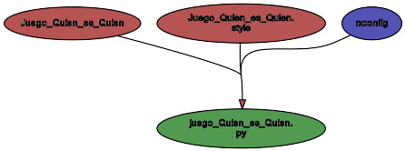
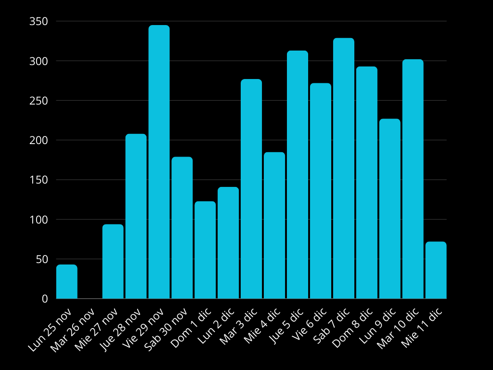
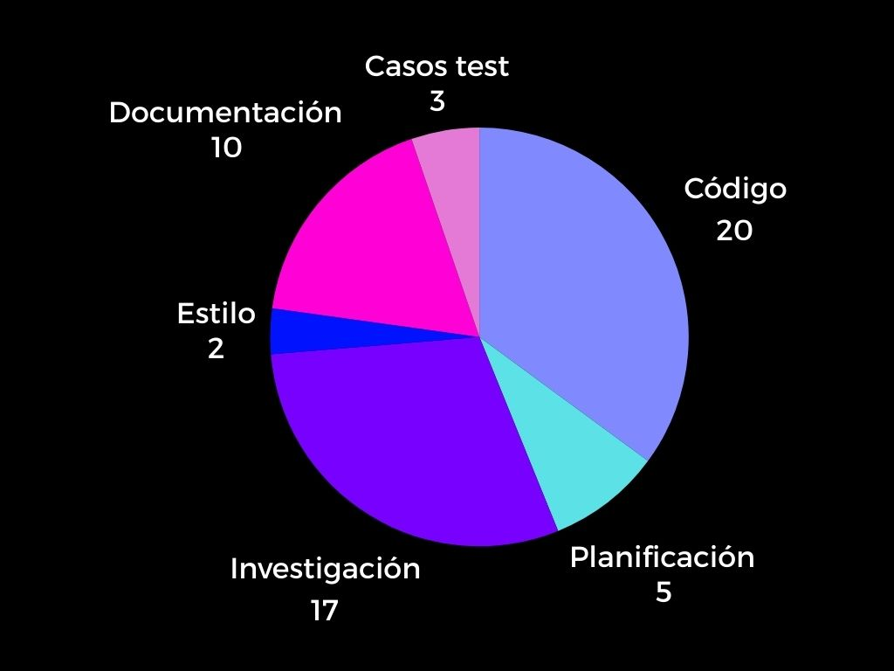
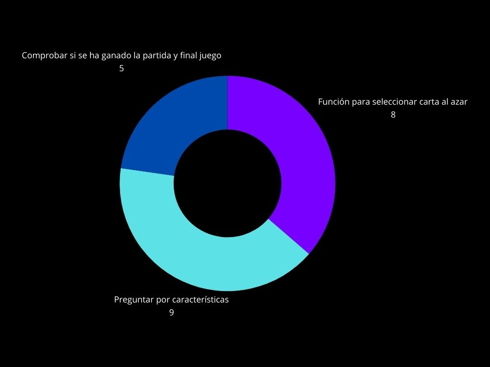

**Tabla de contenidos**

-   [**Introducción**](#introducción)
-   [**Manual**](#manual)
    -   [**Pre-requisitos**](#pre-requisitos)
    -   [**Instalación**](#instalación)
    -   [**Uso**](#uso)
-   [**Metodología**](#metodología)
-   [**Descripción técnica**](#descripción-técnica)
    -   [**Requisitos funcionales y no funcionales NOT LIST**](#requisitos-funcionales-y-no-funcionales-not-list)
    -   [**Historias de usuaria**](#historias-de-usuaria)
    -   [**Arquitectura de la aplicación**](#arquitectura-de-la-aplicación)
-   [**Diseño**](#diseño)
    -   [**Diagrama de Componentes**](#diagrama-de-componentes)
-   [**Implementacion**](#implementacion)
    -   [**Tecnologías y Herramientas utilizadas**](#tecnologías-y-herramientas-utilizadas)
    -   [**Backend**](#backend)
    -   [**Frontend**](#frontend)
-   [**Pruebas**](#pruebas)
    -   [**Coverage**](#coverage)
    -   [**Test de unidad**](#test-de-unidad)
    -   [**Test de integración**](#test-de-integración)
-   [**Análisis del tiempo invertido**](#analisis-del-tiempo-invertido)
    -   [**Clockify y Wakatime**](#clockify-y-wakatime)
    -   [**Justificación temporal**](#justificación-temporal)
-   [**Conclusiones**](#conclusiones)
    -   [**Posibles mejoras**](#posibles-mejoras)
    -   [**Dificultades**](#dificultades)

# Introducción 
En el juego "Quién es Quién" dos personas tienen que adivinar el personaje de su oponente. Cada jugador cuenta con un tablero con diferentes personajes y debe hacer preguntas para ir eliminando opciones hasta dar con el.

# Manual 
# Pre-requisitos 
1- Tener Python 3.9 o superior instalado en tu sistema. 
2- Tener instalado Reflex 
3- Disponer de un editor de código como VSCode 

# Instalación 
1-Una vez instalado vscode y python desde la pagina oficial, se descarga el repositorio con la aplicación desde nuestro github.  

2-Dentro de la terminal que dispone VSCode cocamos el repositorio con el comando git clone [https://github.com/arianaborrajo/Juego-Quien-es-Quien.git]. 

3-A continuación creamos y activamos un entorno virtual usando venv y desde ahi ejecutamos en la terminal el comando pip install reflex para instalar reflex. 

4- Luego lo ejecutamos con run reflex y vemos la aplicación con http://localhost:3000.

# Uso 
El juego "¿Quién es quién?" está diseñado para que el usuario adivine el personaje que la máquina ha seleccionado. La máquina seleccionará un personaje al azar al inicio del juego y responderá únicamente a las preguntas del usuario. Estos pasos para jugar:   
Primero de todo, ejecuta el proyecto siguiendo los pasos del apartado instalación. Una vez iniciado la máquina seleccionará un personaje secreto de forma aleatoria entre las cartas disponibles. 
Puedes formular preguntas sobre las características de los personajes, las cuales la máquina responderá. Según las respuestas de la máquina, se descartan las cartas que no coincidan con las características. Cuando creas saber quién es el personaje secreto, haz tu elección.  En caso de acertar, se gana la partida. Si no, puedes volver a intentarlo. Al finalizar, puedes reiniciar la aplicación para jugar nuevamente con un personaje diferente.

# Metodología: 
Desde el inicio del proyecto, adoptamos una metodología organizada para poder alcanzar los objetivos del proyecto. El primer día dedicamos tiempo a identificar las metas principales del proyecto y a dividirlas en tareas más pequeñas que pudieran cumplirse diariamente. Esto lo organizamos en una not list en papel, donde escribimos los objetivos que queríamos evitar y las tareas pendientes por día. Esto nos ayudó evitar acumulaciones de trabajo aunque finalmente el tiempo no nos sobro. 
A continuación redactamos en git las historias de usuario para que nos fuera más sencillo alcanzar nuestros objetivos. Estas historias nos ayudaron a visualizar el comportamiento esperado de la aplicación y analizar que tareas necesitaban prioridad.
Cada día, al inicio de las horas de trabajo del proyecto, hicimos una daily para comentar los obstáculos que se nos presentaron, informarnos sobre el progreso de la aplicación y para acordar las tareas que había que completar en el día. 

Durante las horas de clase dedicadas al proyecto, aprovechamos el tiempo para avanzar lo máximo posible y resolver rápidamente las dudas que surgían. Fuera de clase, continuamos trabajando desde casa a partes iguales. Se nos presentaron algunas dificultades que con la documentación proporcionada se pudieron resolver. El diseño es básico ya que dedicamos la mayor parte del tiempo a la lógica y a implementar nuestros conocimientos para poder aplicarlos.

# Descripción técnica 
Este proyecto es una implementación digital del juego 'Quién es Quién', desarrollado en lenguaje python y utilizando Reflex, framework de Python diseñado para crear aplicaciones web de manera sencilla. Permite desarrollar la lógica y interfaz en Python.  
Además, la lógica del juego se estructura en Modelo Vista Controlador. El MVC divide la lógica en partes independientes para facilitar el desarrollo. Además, permite modificar la vista o la lógica sin afectar al resto de componentes. Estas tres partes iguales son: Modelo, encargado de gestionar la lógica como la lista de personajes la Vista, parte que el usuario ve y Controlador, que actúa como intermediario entre el modelo y la vista, recibiendo las preguntas del usuario.

# Requisitos funcionales y no funcionales NOT LIST 
La not list que elaboramos al inicio del proyecto se basa en:
In scope 
Función para elegir carta aleatoria. 
Mostrar el tablero. 
Ingresar características de los personajes. 
Confirmar si el jugador gano perdió la partida.  
Out scope 
Tiempo de respuesta para adivinar 
Ocultar cartas que no coincidan con características. 
Numero de intentos para adivinar. 
Interfaz gráfica más compleja. 
Unresolved 
    Guardar historial de partidas 
	Multijugador.

# Historias de usuaria 

*Quién* El Sistema  
*Qué* Seleccionar una carta 
*Para* Jugadora intente adivinarla 

# Test de aceptación:
Al iniciar, el juego selecciona de manera aleatoria una carta.
La carta no se muestra a la jugadora.
Cada carta sale elegida aproximadamente el mismo numero de veces que el resto.

*Quién* jugador, 
*Qué* preguntar las características del personaje  
*Para* descartar personajes y poder adivinar. 

# Criterios de aceptación:

La aplicación debe permitir hacer preguntas predefinidas para poder descartar opciones.
La máquina debe responder las preguntas para poder descartar.
En función de las respuestas, bajar los personajes descartandolos para poder adivinar.

*Quién* jugador, 
*Qué* adivinar el personaje de la maquina, 
*Para* ganar. 

# Criterios de aceptación:

Cuando queden pocos personajes se permite en lugar de hacer preguntas, adivinar directamente.
Si solo quedan dos personajes es obligatorio adivinar.
Si es correcta la respuesta, el  usuario gana.
Si es incorrecta la respuesta, el usuario pierde y ganaría la máquina. 

# Arquitectura de la aplicación
La aplicación &quot;Juego ¿Quién es Quién?&quot; está organizada utilizando el framework
Reflex para construir interfaces dinámicas y reactivas. A continuación, se describe la
arquitectura y los componentes principales: 
1. Estructura de Carpetas 
assets = Archivos estáticos (imágenes). 
__init__.py = Inicialización del módulo principal. 
Juego_Quien_es_Quien.py = Componentes de la interfaz de usuario. 
state.py = Lógica del estado y eventos. 
style.py = Color y estilos para los componentes del
interfaz. 
venv/ = Entorno virtual 
README.md = Documentación del proyecto 
Requirements.tx. = Dependencias. 
rxconfig.py = Configuración global de Reflex. 
2. Componentes Principales 
a. Estado de la Aplicación (state.py) 
Este archivo define el estado central de la aplicación utilizando las herramientas de
Reflex. Aquí se manejan: 
*Variables de estado:* Contiene la definición de los personajes y sus atributos
en formato de una lista de diccionarios. La variable del personaje oculto con
la ejecución. Un mensaje vacío para que pueda ser utilizado y modificado.
Ganador False ya que el jugador comienza el juego no siendo un ganador. 

*Eventos:* Da inicio a una partida, selecciona un personaje al azar, arroja un
mensaje para darle inicio al juego. Gestionan la interacción del usuario, como
hacer preguntas y obtener respuestas. Organiza las pregunta y respuestas en
un historial tipo chat. 

b. Interfaz de Usuario (Juego_Quien_es_Quien.py)
Este archivo contiene los componentes de la interfaz organizados en páginas. Se
utiliza la biblioteca Reflex para crear elementos interactivos, como: 
*Título del juego* 
*Botón que da inicio a la partida* 
*Mensaje para dar aviso del inicio* 
*Tablero con las cartas* 
*Historial de preguntas y respuestas* 
*Casilla de entrada para realizar las preguntas* 
*Botón de enviar pregunta* 

c. Estilo de los Componentes (style.py) 
Definición de color, tamaño y estilo de las preguntas y respuestas, casilla de entrada
de preguntas y botón de enviar. 
# Diseño
# Diagrama de Componentes  

# Implementacion
# Tecnologías y Herramientas utilizadas

En el desarrollo del juego utilizamos varias herramientas y técnicas para construir tanto el backend como el frontend. A continuación, se describen las principales tecnologías empleadas en el proyecto. 
El lenguaje principal utilizado para la lógica del juego fue Python. Python es un lenguaje versátil y fácil de aprender, lo que nos permitió implementar todas las funcionalidades necesarias para el juego de manera eficiente. 

Se utilizo Reflex, un framework de Python diseñado para crear aplicaciones web interactivas. Lo usamos para desarrollar el frontend del juego, ya que nos permitió crear la interfaz de usuario sin la necesidad de trabajar directamente con HTML, CSS o JavaScript. Reflex se encargó de gestionar la visualización de las cartas, las preguntas, y las respuestas, lo que facilitó mucho el proceso de desarrollo. 

Github se uso para el control de versiones durante todo el proyecto. Lo utilizamos para registrar los avances del proyecto, para almacenar el código y para presentarlo, además de que nos garantizo el acceso al proyecto a ambas para trabajar de manera eficaz.  

Para escribir y editar el código, utilizamos Visual Studio Code, un editor de código fuente que es fácil de conectar con Git, permitiendo enlazar todas las partes de manera más rápida y efectiva. 

# Backend 
El backend está diseñado para gestionar la lógica del juego. Esta capa es el núcleo que permite que el juego funcione correctamente. En el se incluyen la selección del personaje aleatorio de la lista predefinida, recibe las preguntas del usuario sobre las características de los personajes y evalúa si coinciden con el personaje secreto y permite reiniciar la partida, seleccionando un nuevo personaje secreto. 
En cuanto a la estructura del backend esta dividida en modelo y lógica, en el modelo se almacena la lista de personajes y sus características definidas en la lista, mientras que la lógica contiene las funciones para procesar las preguntas y descartan las cartas que no se identifiquen con las caracterisitas dadas. 

# Frontend 
El frontend es la parte visible del juego para el usuario. Está implementado utilizando Reflex. Las Funcionalidades principales que engloba son la interfaz de preguntas para que el usuario pueda realizar las preguntas y la visualización de las cartas al inicio del juego . 
En resumen, el backend se comunica con el frontend a través de Reflex, actualizando la vista con las respuestas a las preguntas del usuario. El frontend envía las preguntas del usuario al backend y muestra las respuestas correspondientes, actualizando la visualización de las cartas. 

# Pruebas 
*Pendiente*
# Coverage 
*Pendiente*
# Test de unidad 
*Pendiente*
# Test de integración 
*Pendiente*
# Análisis del tiempo invertido 
# Clockify y Wakatime
  

  

  

# Justificación temporal 
El desarrollo del proyecto de "¿Quién es Quién?" fue un proceso que se extendió durante dos semanas. Al principio, al ser estudiantes de primero de DAM con conocimientos básicos en Python, nos encontramos con varias dificultades que nos obstacularizaron el inicio del proyecto, por lo que iba con retraso. Durante la primera semana, las primeras horas fueron particularmente difíciles, ya que no sabíamos exactamente cómo empezar ni por dónde enfocar el proyecto.  

A pesar de que el enunciado del proyecto estaba claro, nos resultaba complicado entender cómo organizar y dividir el trabajo entre el backend y el frontend, especialmente porque estábamos usando Reflex sin experiencia previa, pero gracias a organizarnos con las historias de usuario y a informarnos en las clases siguientes pudimos comenzar a trabajar en casa. 

En las primeras sesiones, dedicamos varias horas a familiarizarnos con Reflex. En esta fase perdimos mucho tiempo intentando entender las bases del proyecto y cómo empezar.
Ya en la segunda semana, el trabajo comenzó a tomar más forma como se aprecia en el incremento de horas en la tabla, siendo la ultima semana la más productiva.  
Durante esta segunda semana, logramos avanzar considerablemente, ya que pudimos implementar la mayor parte de la lógica y también comenzamos a hacer las primeras pruebas, detectando y corrigiendo errores pero aun quedaban algunos detalles, como la mejora de la interfaz. Y como se puede observar los días que hay picos de diferencia, disponíamos de más tiempo para dedicarlo en el proyecto. 

# Conclusiones 
El desarrollo de este juego de "Quién es Quién"  es una oportunidad para aplicar los conocimientos adquiridos durante el trimestre, al integrar conceptos fundamentales de programación, Gracias a este proyecto hemos podido implementar nuestros conocimientos de manera práctica. 

Durante el proceso de desarrollo el frontend interactúa de manera dinámica con el backend para gestionar la partida. El uso de Reflex para la interfaz de usuario ha facilitado el proceso al ahorrarnos tiempo para dedicar en otros apartados, además de proporcionar flexibilidad y Modularidad,  conectando todo más fácilmente. 

Las pruebas unitarias han sido fundamentales para verificar el funcionamiento correcto de cada componente individual del sistema, mientras que las pruebas de integración han permitido garantizar que todas las partes del juego interactúan correctamente. Además, la cobertura de pruebas ha superado el 85%, lo que asegura que la mayoría del código es confiable. 

A nivel de metodología de desarrollo,  a pesar de tratarse de un proyecto en el que debíamos trabajar con herramientas y tecnologías que no conocíamos, fue efectiva y nos permitió cumplir con la mayoría de los objetivos establecidos al inicio, aprender nuevas herramientas y mejorar nuestra gestión de proyectos de trabajo, la cual nos servirá de mucho en un futuro en empresas. 

A pesar de los logros alcanzados, este proyecto también ha permitido identificar áreas de mejora. A futuro, se podrá expandir el juego incorporando nuevas funcionalidades, como las mejoras redactadas en el apartado siguiente. Además, sería interesante aumentar los casos test para asegurarse mayor cobertura. 

# Posibles mejoras 
Hay varias áreas en las que podemos mejorar proximamente: Mejorar la parte gráfica; el juego se basa en una interfaz sencilla, pero se podría añadir una interfaz más visual, se podría incluir limite de tiempo de preguntar para agilizar el juego o limite de intentos para darle más dinámica, además de incluir más características a los personajes para hacer preguntas más variadas y especificas sobre los personajes.
Además de que, a pesar del tiempo invertido, no fuimos capaces de tener casos test al no reconocernos la ruta. 

# Dificultades 
A lo largo del desarrollo del proyecto, nos encontramos con varios desafíos que nos ayudaron a aumentar nuestros conocimientos. Algunas de las principales dificultades fueron que al principio nos costó comprender cómo organizar el proyecto correctamente, esto nos resto tiempo que hizo que se nos acumulara el trabajo y aprender a utilizar de manera practica los conceptos estudiados en clase y aplicarlos a un proyecto.  
Por otro lado, al trabajar en git, se nos presentaron múltiples problemas con las ramas porque no sabíamos gestionarlas ni bajarlas a remoto y no queríamos perder los cambios de ninguna. Relacionada con esta dificultad, nos costó un poco acostumbrarnos a la práctica de hacer commits frecuentes y bien estructurados, cometimos algunos errores en cuanto al uso de commits, ya que nos daba bastantes errores a las dos al intentar subirlos a github tanto en clase como en casa.

# Uso IA 

Utilizamos ChatGPT versión 4. Nos dio la organización que podiamos seguir para la creación del proyecto indicandonos las prioridades minimas en la cual debiamos trabajar.
No sabiamos por donde comenzar así que la utilizamos para organizarnos. Posteriormente ingresamos algunos errores que se nos generaba al intentar ejecutar el proyecto y según la respuesta buscabamos solucionarlo. Nos sirvió para tener a mano los comandos de git y comprender lo de las ramas.

